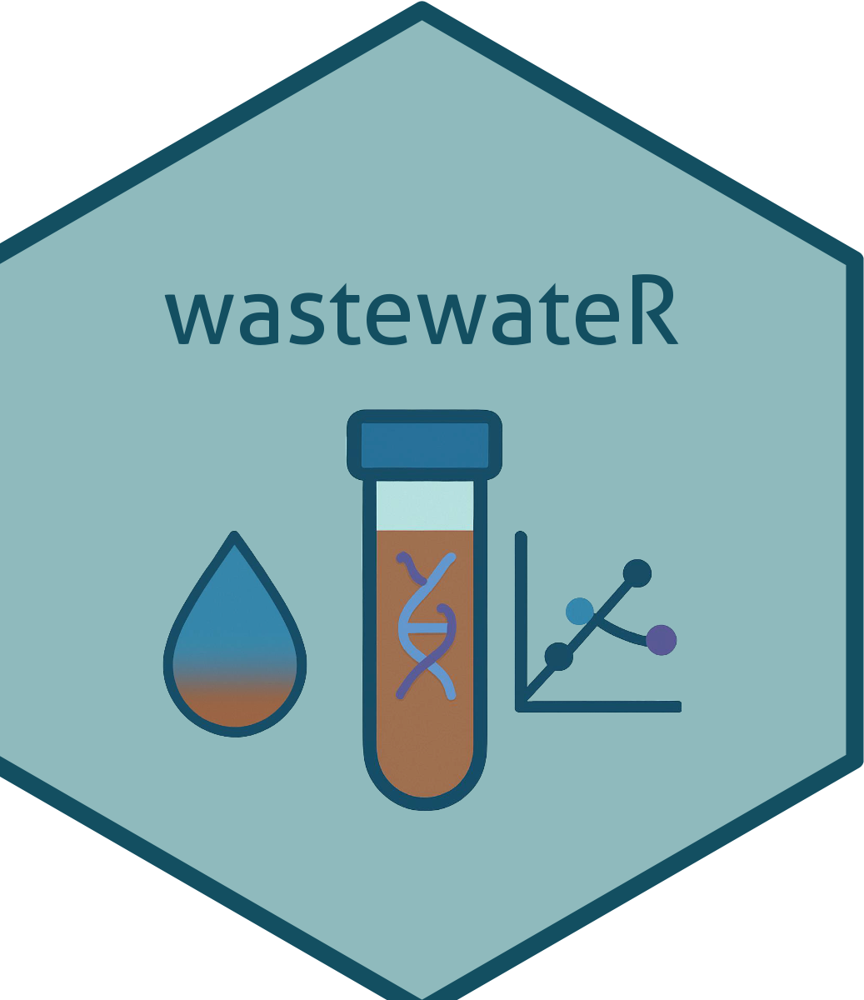

#  wastewateR

The `{wastewateR}` R package contains helper functions relevant for wastewater qPCR projects for in-house and collaborator needs. 

<p>&nbsp;</p>


## How to install the package:

```{r}
devtools::install_github("dionnecargy/wastewateR") # To download the package
library(wastewateR) # To load the package 
```
