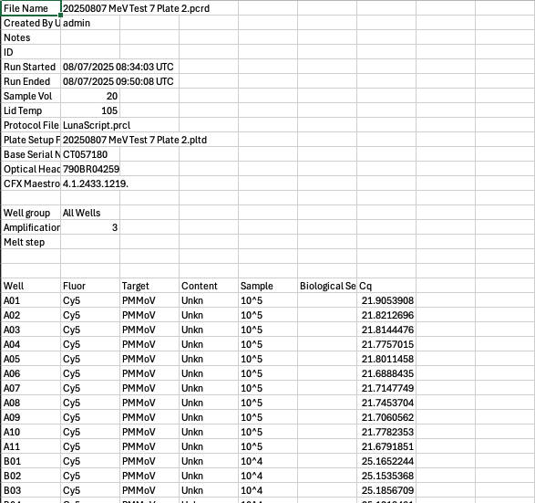
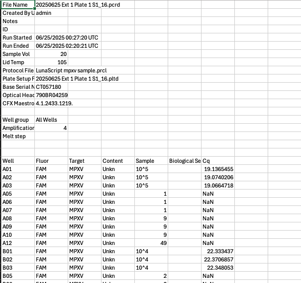
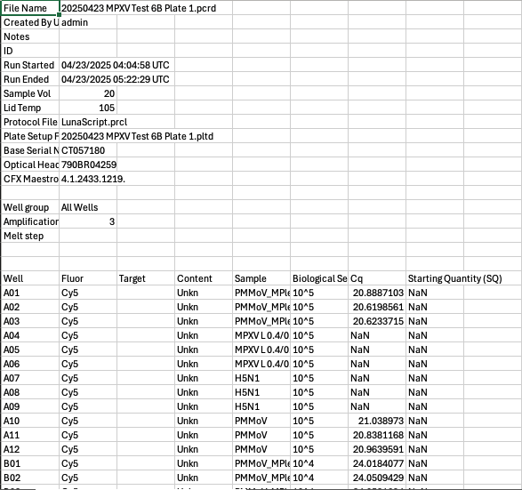

```{r set up R packages}
#| echo: false
#| warning: false
#| message: false

library(here)
library(janitor)
library(stringr)
library(tidyverse)
library(knitr)
library(kableExtra)

devtools::install_github("dionnecargy/wastewateR")
library(wastewateR)
```

## Load the package on your computer 

If you would like to follow along on your own computer: 

```{r}
#| warning: false
#| message: false
#| code-line-numbers: "1-3"
devtools::install_github("dionnecargy/wastewateR")
library(wastewateR)
```

## How the package works

- Enter your raw qPCR data
- Package will read and manipulate data
- Inspect replicate samples
- Summarise qPCR data (Mean, Median, Min/Max, etc.)
- Get PCR efficiency, R2, slope, intercept
- Plot standard curve 
- Evaluate LOD and LOQ

## How the package works

I have created three key "use-cases": 

1. Multiple plates
2. Samples and standards
3. Multiplex vs. Simplex 

And another case where you might need to define the "targets" in R if you haven't done so in the qPCR machine settings. 

## Step 1: Read and Manipulate Data

**Use-Case One: Multiple plates**

```{r}
#| eval: false
#| exec: false
raw_data <- c(
  "data/test_LOD_LOQ/20250807 MeV Test 7 Plate Threshold Adjusted.csv",
  "data/test_LOD_LOQ/20250807 MeV Test 7 Plate 2 Thresholds Adjusted.csv",
  "data/test_LOD_LOQ/20250807 MeV Test 7 Plate 3 Thresholds Adjusted.csv"
)
use_case_one <- readqPCR(
  raw_data = raw_data,
  MPlex = "No", 
  Samples = "No"
)
```

```{r}
#| echo: false 
raw_data <- c(
  "data/test_LOD_LOQ/20250807 MeV Test 7 Plate Threshold Adjusted.csv",
  "data/test_LOD_LOQ/20250807 MeV Test 7 Plate 2 Thresholds Adjusted.csv",
  "data/test_LOD_LOQ/20250807 MeV Test 7 Plate 3 Thresholds Adjusted.csv"
)
use_case_one <- readqPCR(
  raw_data = raw_data,
  MPlex = "No", 
  Samples = "No"
)
```

## Step 1: Read and Manipulate Data

**Use-Case One: Multiple plates**

:::: {.columns}

::: {.column width="50%"}

:::

::: {.column width="50%"}

- Notice how the Well, Fluor, Target, Content, Sample and Cq columns are filled. 
- There is nothing in the "Biological Set Name" column. 
- There is also no SQ column.

:::

::::


## Step 1: Read and Manipulate Data

**Use-Case One: Multiple plates**

```{r}
#| eval: false
#| exec: false
use_case_one$results
```

```{r}
#| echo: false 
use_case_one$results %>% 
  kable() %>%
  kable_styling(
    font_size = 20,  # smaller font
    bootstrap_options = c("striped", "hover")
  ) %>% 
  scroll_box(height = "300px", width = "100%")
```

::: {.small-text}

- Notice how there are three plates in the "Plate" column: 20250807_test, 20250807_plate2_test7, 20250807_plate3_test7
- Automatically fills out the "Plex" column with "SPlex"
- SQ: Starting Quantity column filled out with copy number 

:::

## Step 1: Read and Manipulate Data

**Use-Case One: Multiple plates**

```{r}
#| eval: false
#| exec: false
use_case_one$ntcs
```

```{r}
#| echo: false 
use_case_one$ntcs %>% 
  kable() %>%
  kable_styling(
    font_size = 20,  # smaller font
    bootstrap_options = c("striped", "hover")
  ) %>% 
  scroll_box(height = "300px", width = "100%")
```

::: {.small-text}

Here you will see an output of all NTCs. 

:::

## Step 1: Read and Manipulate Data

**Use-Case One: Multiple plates**

```{r}
#| echo: true 
#| message: true
use_case_one <- readqPCR(
  raw_data = raw_data,
  MPlex = "No", 
  Samples = "No"
)
```

::: {.small-text}

You will get a message automatically for each plate! 

:::

## Step 1: Read and Manipulate Data

**Use-Case Two: Samples and standards**

```{r}
#| eval: false
#| exec: false
use_case_two <- readqPCR(
  raw_data = "data/20250625 Ext 2 Plate 1 S1_16 Threshold Adj Hex_200.csv",
  MPlex = "No", 
  Samples = "Yes"
)
```

```{r}
#| echo: false 
use_case_two <- readqPCR(
  raw_data = "data/20250625 Ext 2 Plate 1 S1_16 Threshold Adj Hex_200.csv",
  MPlex = "No", 
  Samples = "Yes"
)
```

## Step 1: Read and Manipulate Data

**Use-Case Two: Samples and standards**

:::: {.columns}

::: {.column width="50%"}

:::

::: {.column width="50%"}

- There are both standards and samples in this plate. 

:::

::::

## Step 1: Read and Manipulate Data

**Use Case Three: Multiplex vs. Simplex** and example of where **targets are not defined**

```{r}
#| eval: false
#| exec: false
target_mplex_splex = data.frame(
  Target = c("H5N1", "H5N1", "MPXV", "MPXV", "MS2", "MS2", "PMMoV", "PMMoV"), 
  Sample = c("H5N1", "H5N1_MPlex", "MPXV L 0.4/0.2", "MPXV L 0.4/0.2_MPlex", "MS2", "MS2_MPlex", "PMMoV", "PMMoV_MPlex")
)
use_case_three <- readqPCR(
  raw_data = "data/20250423 MPXV Test 6B Plate 1_edited_DA.csv", 
  MPlex = "Yes", 
  Samples = "No", 
  Target = target_mplex_splex
)
```

```{r}
#| echo: false 
target_mplex_splex = data.frame(
  Target = c("H5N1", "H5N1", "MPXV", "MPXV", "MS2", "MS2", "PMMoV", "PMMoV"), 
  Sample = c("H5N1", "H5N1_MPlex", "MPXV L 0.4/0.2", "MPXV L 0.4/0.2_MPlex", "MS2", "MS2_MPlex", "PMMoV", "PMMoV_MPlex")
)
use_case_three <- readqPCR(
  raw_data = "data/20250423 MPXV Test 6B Plate 1_edited_DA.csv", 
  MPlex = "Yes", 
  Samples = "No", 
  Target = target_mplex_splex
)
```

## Step 1: Read and Manipulate Data

**Use Case Three: Multiplex vs. Simplex** and example of where **targets are not defined**

:::: {.columns}

::: {.column width="50%"}

:::

::: {.column width="50%"}

- Notice how "Biological Set Names" is filled in as well as Samples
- Target is empty
- SQ is here but NA

:::

::::

## Now that we've read in our data, we need to understand it! {#TitleSlide data-menu-title="Part2" style="font-size:80px;padding: 5px "}

## Step 2: Summarise qPCR results 

**Part 1: Inspect replicates **

```{r}
#| eval: false
#| exec: false 
getReplicates(use_case_one)
getReplicates(use_case_two, Samples = "y")
getReplicates(use_case_three)
```

The `getReplicates()` function will allow us to inspect the qPCR results. Are you satisfied with the results?

## Step 2: Summarise qPCR results 

**Part 1: Inspect replicates **

```{r}
#| eval: false
#| exec: false 
?getReplicates
```

If you write this in your console, you will see a description of what the function expects. 
Note that the default is `Samples = "n"`. 

## Step 2: Summarise qPCR results 

**Part 1: Inspect replicates **

```{r}
#| eval: false
#| exec: false 
getReplicates(use_case_one)
```

```{r}
#| echo: false 
getReplicates(use_case_one) %>% 
  kable() %>%
  kable_styling(
    font_size = 20,  # smaller font
    bootstrap_options = c("striped", "hover")
  ) %>% 
  scroll_box(height = "300px", width = "100%")
```

:::: {.small-text}

- All replicates for each Target, Fluor, SQ, Plex are grouped together. 
- A new column `NullFlag` is created: PASS = Are there 3 or more replicates that are no-NA? 

::: {.callout-success title="Discussion"}
Happy to make `NullFlag` be FAIL if **any** are negative. 
:::

::::

## Step 2: Summarise qPCR results 

**Part 1: Inspect replicates **

```{r}
#| eval: false
#| exec: false 
getReplicates(use_case_three)
```

```{r}
#| echo: false 
getReplicates(use_case_three) %>% 
  kable() %>%
  kable_styling(
    font_size = 20,  # smaller font
    bootstrap_options = c("striped", "hover")
  ) %>% 
  scroll_box(height = "300px", width = "100%")
```

:::: {.small-text}

- Notice how all replicates that have NAs are listed. 

::::

## Step 2: Summarise qPCR results 

**Part 2: Summarise qPCR data**

```{r}
#| eval: false
#| exec: false
summariseqPCR(use_case_one)
summariseqPCR(use_case_two, Samples = "y")
summariseqPCR(use_case_three)
```

## Step 2: Summarise qPCR results 

**Part 2: Summarise qPCR data**

```{r}
#| eval: false
#| exec: false
summariseqPCR(use_case_one)
```

```{r}
#| echo: false 
summariseqPCR(use_case_one) %>% 
  kable() %>%
  kable_styling(
    font_size = 20,  # smaller font
    bootstrap_options = c("striped", "hover")
  ) %>% 
  scroll_box(height = "150px", width = "100%")
```

::: {.small-text}

- `difference`: What is the difference between the min and max Cq? 
- `range_score`: Is the difference between min & max Cq ≤ 0.5 (pass) or Cq > 0.5 (fail)?
- `mean_diff`: What is the absolute change in Cq? (mean - lowest Cq)
- `log_diff`: What is the absolute change in log copy number?
- `exp_ratio`: log_diff $\times$ 3.32
- `dilution`: Are dilutions within an expected ratio 3.3Cq $\pm$ 0.5 for each 1:10 dilution? 

:::

## Step 2: Summarise qPCR results 

**Part 3: PCR efficiency, $R^2$, slope, intercept**

```{r}
#| eval: false
#| exec: false 
plotStd(use_case_one)
plotStd(use_case_two, Samples = "y")
plotStd(use_case_three, MPlex = "y")
```

## Step 2: Summarise qPCR results 

**Part 3: PCR efficiency, $R^2$, slope, intercept**

```{r}
#| eval: false
#| exec: false 
standards <- plotStd(use_case_one)
standards$results_table
```

```{r}
#| echo: false
standards <- plotStd(use_case_one)
standards$results_table %>% 
  kable() %>%
  kable_styling(
    font_size = 20,  # smaller font
    bootstrap_options = c("striped", "hover")
  ) %>% 
  scroll_box(width = "100%")
```

## Step 2: Summarise qPCR results 

**Part 3: PCR efficiency, $R^2$, slope, intercept**

```{r}
standards <- plotStd(use_case_one)
standards$stdcurve_plot
```

## Step 2: Summarise qPCR results 

**Part 3: PCR efficiency, $R^2$, slope, intercept**

```{r}
standards_use_case_three <- plotStd(use_case_three, MPlex = "y")
standards_use_case_three$stdcurve_plot
```

## Now that we understand our data, how about the analytical method validation? {#TitleSlide2 data-menu-title="Part3" style="font-size:70px;padding: 5px "}

## Step 3: LOD/LOQ 

**Part 1: Evaluate LOD** (discrete version) 

Limit of Detection: "Analytical Sensitivity" 

> Lowest concentration of target analyte that can be detected with a defined level of confidence, with a 95% detection rate as the standard confidence level. 

## Step 3: LOD/LOQ 

**Part 1: Evaluate LOD** (discrete version) 

```{r}
#| eval: false
#| exec: false
getLoD(use_case_one)
getLoD(use_case_two, Samples = "y")
getLoD(use_case_three, MPlex = "y")
```

## Step 3: LOD/LOQ 

**Part 1: Evaluate LOD** (discrete version) 

```{r}
#| eval: false
#| exec: false
LoD_use_case_one <- getLoD(use_case_one)
LoD_use_case_one$LoD_table
```

```{r}
#| echo: false
LoD_use_case_one <- getLoD(use_case_one)
LoD_use_case_one$LoD_table %>% 
  kable() %>%
  kable_styling(
    font_size = 20,  # smaller font
    bootstrap_options = c("striped", "hover")
  )
```

## Step 3: LOD/LOQ 

**Part 1: Evaluate LOD** (discrete version) 

```{r}
#| eval: false
#| exec: false
LoD_use_case_one <- getLoD(use_case_one)
LoD_use_case_one$LoD_plot
```

```{r}
#| echo: false
LoD_use_case_one <- getLoD(use_case_one)
LoD_use_case_one$LoD_plot
```

## Step 3: LOD/LOQ 

**Part 1: Evaluate LOD** (discrete version) 

```{r}
LoD_use_case_three <- getLoD(use_case_three, MPlex = "y")
LoD_use_case_three$LoD_plot
```

## Step 3: LOD/LOQ 

**Part 2: Evaluate LOQ** (discrete version) 

::: {.small-text}

Based on the method described in Schang et al., 2021 *Environ. Sci. Technol.* where the LOQ was estimated from the replicated standard curves and standard dilutions. 

The coefficient of variation (CV) for log-normal distributed datasets is calculated using the equation:
:::

$$
CV = \sqrt{ (1 + E)^{SD^2 \times \ln(1+E)} - 1 }
$$

::: {.small-text}
where E is the PCR efficiency and SD is the standard deviation across replicate Cq values for a standard curve dilution.

If the LOQ is observed between two values of log copies per reactions, then it is **estimated** using a **linear interpolation** between these data points. 
:::

## Step 3: LOD/LOQ 

**Part 2: Evaluate LOQ** (discrete version) 

```{r}
#| eval: false
#| exec: false
getLoQ(use_case_one)
getLoQ(use_case_two, Samples = "y")
getLoQ(use_case_three, MPlex = "y")
```

## Step 3: LOD/LOQ 

**Part 2: Evaluate LOQ** (discrete version) 

```{r}
#| eval: false
#| exec: false
loq_use_case_one <- getLoQ(use_case_one)
loq_use_case_one$LoQ_table
```

```{r}
#| echo: false
loq_use_case_one <- getLoQ(use_case_one)
loq_use_case_one$LoQ_table %>% 
  kable() %>%
  kable_styling(
    font_size = 20,  # smaller font
    bootstrap_options = c("striped", "hover")
  ) 
```

## Step 3: LOD/LOQ 

**Part 2: Evaluate LOQ** (discrete version) 

```{r}
loq_use_case_one <- getLoQ(use_case_one)
loq_use_case_one$LoQ_plot
```

## Step 3: LOD/LOQ 

**Part 2: Evaluate LOQ** (discrete version) 

```{r}
#| eval: false
#| exec: false
loq_use_case_three <- getLoQ(use_case_three)
loq_use_case_three$LoQ_table
```

```{r}
#| echo: false
loq_use_case_three <- getLoQ(use_case_three)
loq_use_case_three$LoQ_table %>% 
  kable() %>%
  kable_styling(
    font_size = 20,  # smaller font
    bootstrap_options = c("striped", "hover")
  ) 
```

## Step 3: LOD/LOQ 

**Part 2: Evaluate LOQ** (discrete version) 

```{r}
loq_use_case_three <- getLoQ(use_case_three, MPlex = "y")
loq_use_case_three$LoQ_plot
```

## To Do 

- [ ] Address outliers in standard curve 
- [ ] Analyse samples 
- [ ] Create master pipeline 

## And that's the `{wastewateR}` package so far! {#TitleSlide3 data-menu-title="End" style="font-size:70px;padding: 5px "}

Let me know if you have any additional thoughts! 
